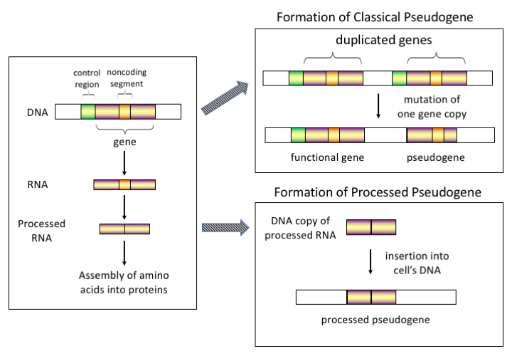

## Load libraries, such as tidyverse and tidybiology
```{r setup, include=FALSE}
library(tidyverse)
library(tidybiology)
library('dplyr')

# For correlation analysis 
install.packages('DataExplorer')
library('DataExplorer')
install.packages('skimr')
library('skimr')

# For plotting 
install.packages('quantreg')
library('quantreg')
# install.packages('plotly')
# library(plotly)

#uncomment (or select) to clear environment; good for provenance
rm(list=ls()) 
```

## Import data
I mainly worked on the chromosome dataset in the tidybiology package 
```{r import, include=FALSE} 
#IMPORT YOUR DATA
#MAKE SURE TO GET THE CODE CHUNK OPTIONS SET

# I want to have a look of what datasset are inside those libraries
# data(package = "tidyverse") # tidyverse doesn't have any dataset
# data(package = "tidybiology") # It has 10 datasets
data(chromosome)
```

## Take a `glimpse` into the data in the dataframe
The dataset chromosome has 24 rows (for 24 chromsomes) and 14 variables for different properties of the 24 human chromosomes. 
```{r glimpse, echo=FALSE}
#DEPENDING ON DATA, NOT TOTALLY NECESSARY
glimpse(chromosome)
```
## More statistics by `skim` for a general sense of the dataset
```{r echo=FALSE}
skim(chromosome)
```


## EDA
I began with a correlation analysis of all the factors with each other and it turned out that all of them are positively correlated by a certain degree. 
```{r echo=FALSE}
#COMMENCE ROLLING
#MAKE COMMENTS
#WRITE WHAT YOU SEE
plot_correlation(na.omit(chromosome))
```

## EDA Graph  
Inspired by the new PCB faculty Zhao Zhang ZZ's research on regulatory gene elements, I want to explore more into the pseudo-genes and their origins. Some people might think that pseudo-genes and protein-coding genes are negatively correlated, but it is actually the opposite. After being standarized by the chromosome lengthes, chromosomes with more protein-coding genes tend to have more pseudo-genes. 

```{r echo=FALSE}
ggplot(chromosome) +
  geom_smooth(aes(x=pseudo_genes/basepairs, y=protein_codinggenes/basepairs),method = "auto", color=34)+
  geom_quantile(aes(x=pseudo_genes/basepairs, y=protein_codinggenes/basepairs))+
  geom_point(aes(x=pseudo_genes/basepairs, y=protein_codinggenes/basepairs))+
  geom_point(data=chromosome[chromosome$id=='Y',],aes(x=pseudo_genes/basepairs, y=protein_codinggenes/basepairs),pch=21, fill=NA, size=15, colour="red", stroke=2)+
  geom_label(aes(x=pseudo_genes/basepairs, y=protein_codinggenes/basepairs, label=id))+
  labs(x='Number of pseudo genes per length', y='Number of protein-coding genes per length', title='Chromosomes with more protein-coding genes have more pseudo-genes', subtitle='Number of pseudo genes per length vs. Number of protein-coding genes per length', caption='Data from TidyBiology | Plot from Junqi Lu')+
  theme_minimal()
```

## Final Graph
From the graph above, Y chromosome seems to have a way lower number of protein-coding genes than other chromosomes with similar number of pseudo genes per length. It seems to be an outlier of the trend. Then I made a scatter plot for the pseudo-genes percentage of every chromosome for more comparisons.  

```{r final_graph, echo=FALSE}
new_chromosome <- chromosome %>% 
  mutate(pseudo_genes_percent=(pseudo_genes/(pseudo_genes+protein_codinggenes))*100) %>% 
  mutate(variations_percent=(variations/basepairs))

# The original 3D version
# plot_ly(new_chromosome, x = new_chromosome$pseudo_genes_percent, y = new_chromosome$protein_codinggenes_percent, z = new_chromosome$variations_percent)  

# The original ggplot2 version
ggplot(new_chromosome, aes(x=id, y=pseudo_genes_percent)) +
  geom_point(aes(x=id, y=pseudo_genes_percent, size = new_chromosome$variations_percent))+
  geom_point(data=new_chromosome[new_chromosome$variations_percent<.01,],pch=21, fill=NA, size=6, colour="red", stroke=2) +
  scale_size(range = c(.001, 7), name="Variations per bp")+
  geom_hline(yintercept=41.87, linetype="dashed", color="blue", size=2)+
  geom_text(x=18, y=39, label="Average = 41.97%", color="blue")+
  geom_text(x=19.5, y=84.53, label="84.53% ←", color="red", size=9)+

  labs(x='Chromosome ID', y='Pseudo-genes percentage (%)', title='Y chromosome has the highest pseudo-genes percentage but lowest variation', subtitle='Pseudo-genes percentage on each chromosome', caption='Data from TidyBiology | Plot from Junqi Lu')+
  theme_light()

ggsave("Lu Pseudo-genes percentage.png")
  
```

## Conclusions
The Y chromosome has way more pseudo-genes than protein-coding genes when compared to other chromosomes--almost two folds than the average of other chromosomes' pseudo-genes percentage. However, at the same time, the Y chromosome has the lowest variations per basepair. This indicates those genes on the Y chromosome, mostly pseudo-genes, might play critical regulatory roles and thus remain conservative with pressure over time. 

## Prioritized follow-up studies
1. I would like to sequence the Y chromosome from some older human samples to quantify how conservative the Y chromosome's pseudo-genes are over time.      
2. I would also like to classify the pseudo-gene formations of the Y chromosome, whether classical or processed, by investigating the number of non-coding segements, such as introns, on the Y chromosome.     



## Acknolwedgements
I want to acknowledge the papers below for the inspiration:     

* Plagiarized Errors and Molecular Genetics | National Center for Science Education. (2019). Retrieved 21 October 2019, from https://ncse.ngo/plagiarized-errors-and-molecular-genetics    

* Smith, O., Dunshea, G., Sinding, M., Fedorov, S., Germonpre, M., Bocherens, H., & Gilbert, M. (2019). Ancient RNA from Late Pleistocene permafrost and historical canids shows tissue-specific transcriptome survival. PLOS Biology, 17(7), e3000166. doi: 10.1371/journal.pbio.3000166     

I also want to thank the creators for the package tidyverse, tidybiology, and DataExplorer, and Dr. Hirschey and TAs, Allie Mills and Akshay Bareja for teaching this class. Thank you all for listening.

## Session information for provenance and reproducibility
```{r echo=FALSE}
#PROBABLY BEST TO LEAVE THIS HERE, BUT NO NEED TO PRINT IN THE FINAL REPORT.
utils:::print.sessionInfo(sessionInfo()[-8]) 
#You can remove an item from sessionInfo(), which is a list with a class attribute, by printing the resulting object omitting one of the list items (omitted list of packages installed, but not loaded)
```

