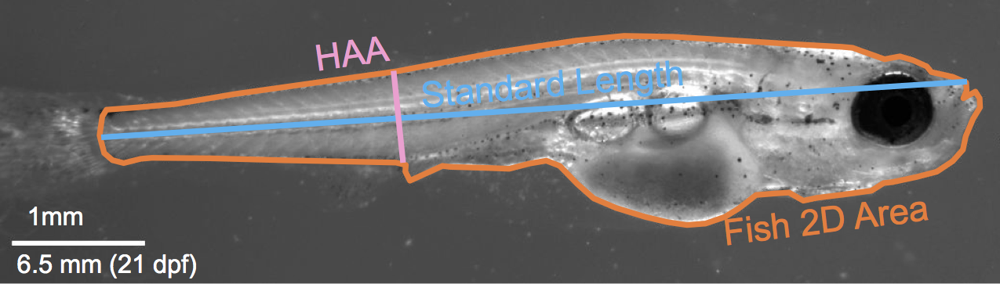

## Load libraries, such as tidyverse and tidybiology
```{r setup, include=FALSE}
library(ggplot2)
library(plotly)
#uncomment (or select) to clear environment; good for provenance
rm(list=ls())
```


## Import data
The data imported was sereis of measurements of zebrafish larvae, which was oiginally collected by me in the Rawls Lab.
```{r import, echo=FALSE}
#IMPORT YOUR DATA
#MAKE SURE TO GET THE CODE CHUNK OPTIONS SET
library(readxl)
Fish2 <- read_excel("Final_FishData2.xls")
```
  
## Take a `glimpse` into the data in the dataframe
The data frame consist of different morphological measurements of zebrafish larvae including their corresponding KO genes
```{r glimpse, echo = FALSE}
Fish2
```



## Zebrafish BMI
I started by exploring the relationship between larvae length and their 2D surface area as a proxy for BMI. Since many of these fish contain genetic mutation associated with obesogenic mutations identified in GWAS. 
```{r, echo = FALSE}
Fish_graph <- ggplot(Fish2, aes(SL, area, colour = gene)) + 
  # ylim(c(0,7.5)) +
  # xlim(c(7.5,18)) +
  geom_point(colour = "grey80", size = 2.5) +
  geom_smooth(colour = "grey", fullrange = TRUE, se = TRUE, size = 0.5) +
  # geom_smooth(data = Fish2, aes(SL,area, colour = gene), fullrange = TRUE, se = TRUE, size = 0.5) +
  # geom_point(data = Fish2, aes(SL, area, colour = "grey"), size = 2.5) +
  xlab("Standard Length(mm)") +
  ylab("Fish 2D area(mm^2)") +
  ggtitle("Measurments of Zebrafish BMI") +
  theme_minimal() +
  theme(plot.title = element_text(hjust = 0.5), 
        legend.position = "none") +
  NULL

Fish_graph

```

## Different mutants BMI comparison  
```{r, echo = FALSE}
Fish_facet <- ggplot(Fish2, aes(SL, HAA, colour = Allele)) +
  geom_point(data = Fish2, aes(SL, HAA, colour = Allele), size = 2.5) +
  xlab("Standard Length(mm)") +
  ylab("Height at anterior of anal fin(HAA)") +
  ggtitle("Measurments of Zebrafish BMI") +
  theme_minimal() +
  theme(plot.title = element_text(hjust = 0.5), 
        legend.position = "none") +
  facet_wrap( ~ gene) +
  NULL
Fish_facet
```
  
  
### Observation
It is clear that there are general trends of some mutants within the genotype that developes differently such as scd. But I wanted to see if more clusters can be identified more obviously when comparing multiple parameters.


## Final Graph
I chose the 3D scatterplot method to visualize the difference between each fish's measurment and their genotype. This method is especially powerful as it allows me to identify different cluster and deviations of groups from the wild type. 
```{r final_graph, echo = FALSE}
#MAKE IT SHINE
Fish_3Dgraph <- plot_ly(Fish2, x = ~SL, y = ~HAA, z = ~area, color = ~gene, marker = list(size = 4), type = 'scatter3d', mode = 'markers') %>%
  layout(scene = list(xaxis = list(title = "Standard Length(mm)"),
                      yaxis = list(title = "Heigh at margin of anal fin(mm)"),
                      zaxis = list(title = "Fish 2D area (mm^2)")), 
         showlegend = FALSE)
Fish_3Dgraph
```

## Conclusions
From the 3D data set shown, we can observe different groups of cluster formed and deviated from the normal zebrafish developmental trajectory. Demonstrating possible phenotype that may be interesting.  

## Prioritized follow-up studies
Potential future study may involve investigating different mutants, and analyzing the metabolic rate or how the maturaty compares to the wild type animals. 

## Acknolwedgements
library(ggplot2)  
library(plotly)  
library(readxl)  
  
    
Allie Mills Ph.D.  
Akshay Bareja D.Phil  
Matthew Hirschey Ph.D.  
John Rawls Ph.D.  

#Session information for provenance and reproducibility
```{r, echo = FALSE}
#PROBABLY BEST TO LEAVE THIS HERE, BUT NO NEED TO PRINT IN THE FINAL REPORT.
utils:::print.sessionInfo(sessionInfo()[-8]) 
#You can remove an item from sessionInfo(), which is a list with a class attribute, by printing the resulting object omitting one of the list items (omitted list of packages installed, but not loaded)
```

