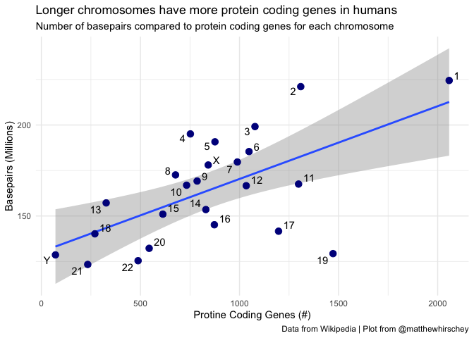
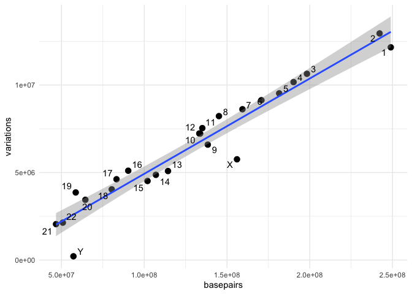
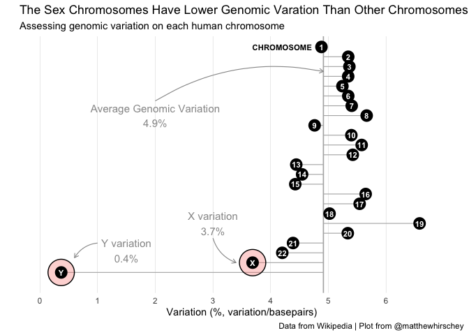

<!-- README.md is generated from README.Rmd. Please edit that file -->

# Tidybiology Final Projects

This respository contains previous final projects by your classmates.
Feel free to browse their projects! Below, you’ll see an example final
project for you to be inspired by. You can download this file or the
template file at the bottom.

## Load libraries

``` r
knitr::opts_chunk$set(
  collapse = TRUE,
  comment = "#>"
)
library(tidyverse)
library(here)
library(glue)
library(ggrepel)
library(ggforce)
library(devtools)
#devtools::install_github("hirscheylab/tidybiology", upgrade = c("always"))
library(tidybiology)

#uncomment (or select) to clear environment; good for provenance
rm(list=ls()) 
```

## Import data

I first loaded chromosome summary data, which was originally scraped
from [a Wikipedia entry about the human
chromosome](https://en.wikipedia.org/wiki/Human_chromosome).

``` r
#data(package = "tidybiology")
data(chromosome)
#View(chromosome)

#add some new variables; went back to add these after EDA below.
chromosome <- 
  chromosome %>% 
  mutate(percent_var = variations/basepairs) %>% #this adds a new column called percent_var to calculate the number of variations/basepairs
  mutate(xy = if_else(str_detect(id, "X") | str_detect(id, "Y"), TRUE, FALSE))  #adds a boolean for whether this is an XY chromosome or not to call them out in the graph
```

## Take a `glimpse` into the data in the dataframe

Next, I found this table has 14 variables and 24 observations (22
numbered chromosomes + X and Y).

    #> Rows: 24
    #> Columns: 16
    #> $ id                     <fct> 1, 2, 3, 4, 5, 6, 7, 8, 9, 10, 11, 12, 13, 14, …
    #> $ length_mm              <dbl> 85, 83, 67, 65, 62, 58, 54, 50, 48, 46, 46, 45,…
    #> $ basepairs              <dbl> 248956422, 242193529, 198295559, 190214555, 181…
    #> $ variations             <dbl> 12151146, 12945965, 10638715, 10165685, 9519995…
    #> $ protein_codinggenes    <int> 2058, 1309, 1078, 752, 876, 1048, 989, 677, 786…
    #> $ pseudo_genes           <int> 1220, 1023, 763, 727, 721, 801, 885, 613, 661, …
    #> $ totallongnc_rna        <int> 1200, 1037, 711, 657, 844, 639, 605, 735, 491, …
    #> $ totalsmallnc_rna       <int> 496, 375, 298, 228, 235, 234, 208, 214, 190, 20…
    #> $ mi_rna                 <int> 134, 115, 99, 92, 83, 81, 90, 80, 69, 64, 63, 7…
    #> $ r_rna                  <int> 66, 40, 29, 24, 25, 26, 24, 28, 19, 32, 24, 27,…
    #> $ sn_rna                 <int> 221, 161, 138, 120, 106, 111, 90, 86, 66, 87, 7…
    #> $ sno_rna                <int> 145, 117, 87, 56, 61, 73, 76, 52, 51, 56, 76, 6…
    #> $ miscnc_rna             <int> 192, 176, 134, 104, 119, 105, 143, 82, 96, 89, …
    #> $ centromereposition_mbp <dbl> 125.0, 93.3, 91.0, 50.4, 48.4, 61.0, 59.9, 45.6…
    #> $ percent_var            <dbl> 0.04880833, 0.05345298, 0.05365080, 0.05344326,…
    #> $ xy                     <lgl> FALSE, FALSE, FALSE, FALSE, FALSE, FALSE, FALSE…

## EDA

I began to explore the relationship between number of protein coding
genes and number of base pairs. Perhaps not surprising, generally longer
chromosomes have more protein coding genes. But that made me curious
about variation.
<!-- -->

    #> # A tibble: 24 × 2
    #>    id    percent_var
    #>    <fct>       <dbl>
    #>  1 Y         0.00370
    #>  2 X         0.0369 
    #>  3 22        0.0420 
    #>  4 21        0.0439 
    #>  5 15        0.0443 
    #>  6 13        0.0444 
    #>  7 14        0.0455 
    #>  8 9         0.0476 
    #>  9 1         0.0488 
    #> 10 18        0.0502 
    #> # ℹ 14 more rows

## EDA Graph

I chose to investigate the relationship between the number of basepairs
and the amount of variation on each human chromosome.
<!-- -->

**The X and Y chromosomes are clearly lower, but how to visualize
this?**

## Final Graph

I chose the lollipop plot method to visualize the difference between
each chromosome’s variation compared to the mean variation

    #> Warning: Using `size` aesthetic for lines was deprecated in ggplot2 3.4.0.
    #> ℹ Please use `linewidth` instead.
    #> This warning is displayed once every 8 hours.
    #> Call `lifecycle::last_lifecycle_warnings()` to see where this warning was
    #> generated.
    #> Warning: The `size` argument of `element_line()` is deprecated as of ggplot2 3.4.0.
    #> ℹ Please use the `linewidth` argument instead.
    #> This warning is displayed once every 8 hours.
    #> Call `lifecycle::last_lifecycle_warnings()` to see where this warning was
    #> generated.

<!-- -->

## Conclusions

The amount of genomic variation is lowest on the X and Y chromosomes,
compared to the remaining human chromosomes. This observation implies
that the fidelity of DNA sequences is more stringent and unique
mechanisms are in place to ensure low variation.

## Prioritized follow-up studies

Chromatin states are known to influence genomic variation. Therefore, I
would like to look at the chromatin state at these genomic loci,
including histone modifications and DNA methylation status.

## Acknolwedgements

I would like to acknowledge Cedric Scherer for [plot
inspiration](https://cedricscherer.netlify.com/2019/05/17/the-evolution-of-a-ggplot-ep.-1/),
@garretgrom, @hadleywickham, and the @rstudio team for making the
tidyverse packages easy to use, and you all for reaching the end of the
class!

## Session information for provenance and reproducibility

    #> R version 4.3.0 (2023-04-21)
    #> Platform: aarch64-apple-darwin20 (64-bit)
    #> Running under: macOS 14.0
    #> 
    #> Matrix products: default
    #> BLAS:   /Library/Frameworks/R.framework/Versions/4.3-arm64/Resources/lib/libRblas.0.dylib 
    #> LAPACK: /Library/Frameworks/R.framework/Versions/4.3-arm64/Resources/lib/libRlapack.dylib;  LAPACK version 3.11.0
    #> 
    #> locale:
    #> [1] en_US.UTF-8/en_US.UTF-8/en_US.UTF-8/C/en_US.UTF-8/en_US.UTF-8
    #> 
    #> time zone: America/New_York
    #> tzcode source: internal
    #> 
    #> attached base packages:
    #> NULL
    #> 
    #> other attached packages:
    #>  [1] tidybiology_0.1.0 devtools_2.4.5    usethis_2.1.6     ggforce_0.4.1    
    #>  [5] ggrepel_0.9.3     glue_1.6.2        here_1.0.1        lubridate_1.9.3  
    #>  [9] forcats_1.0.0     stringr_1.5.0     dplyr_1.1.3       purrr_1.0.2      
    #> [13] readr_2.1.4       tidyr_1.3.0       tibble_3.2.1      ggplot2_3.4.2    
    #> [17] tidyverse_2.0.0  
    #> 
    #> loaded via a namespace (and not attached):
    #>  [1] gtable_0.3.3      xfun_0.40         remotes_2.4.2     htmlwidgets_1.6.2
    #>  [5] processx_3.8.2    lattice_0.21-8    callr_3.7.3       tzdb_0.4.0       
    #>  [9] ps_1.7.5          vctrs_0.6.3       tools_4.3.0       generics_0.1.3   
    #> [13] fansi_1.0.5       pkgconfig_2.0.3   Matrix_1.5-4      lifecycle_1.0.3  
    #> [17] compiler_4.3.0    farver_2.1.1      munsell_0.5.0     httpuv_1.6.11    
    #> [21] htmltools_0.5.6.1 yaml_2.3.7        urlchecker_1.0.1  crayon_1.5.2     
    #> [25] pillar_1.9.0      later_1.3.1       MASS_7.3-60       ellipsis_0.3.2   
    #> [29] cachem_1.0.8      sessioninfo_1.2.2 nlme_3.1-162      mime_0.12        
    #> [33] tidyselect_1.2.0  digest_0.6.33     stringi_1.7.12    labeling_0.4.2   
    #> [37] splines_4.3.0     polyclip_1.10-4   rprojroot_2.0.3   fastmap_1.1.1    
    #> [41] grid_4.3.0        colorspace_2.1-0  cli_3.6.1         magrittr_2.0.3   
    #> [45] pkgbuild_1.4.0    utf8_1.2.3        withr_2.5.1       prettyunits_1.2.0
    #> [49] scales_1.2.1      promises_1.2.0.1  timechange_0.2.0  rmarkdown_2.25   
    #> [53] hms_1.1.3         memoise_2.0.1     shiny_1.7.4       evaluate_0.22    
    #> [57] knitr_1.44        miniUI_0.1.1.1    mgcv_1.8-42       profvis_0.3.8    
    #> [61] rlang_1.1.1       Rcpp_1.0.11       xtable_1.8-4      tweenr_2.0.2     
    #> [65] pkgload_1.3.2     rstudioapi_0.15.0 R6_2.5.1          fs_1.6.3

Download [this Rmd
file](https://github.com/matthewhirschey/tidybiology-final_project/final_project.Rmd)
or [the
template](https://github.com/matthewhirschey/tidybiology-final_project/final_project_template.Rmd)
